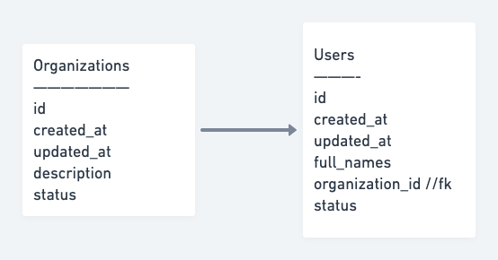

# GraphQL x Sequelize API Framework
A GraphQL implementation of a NodeJS API GW leveraging Sequelize ORM

## Pre-requisites

1. Knowledge of GraphQL (https://graphql.org/) implementation.
2. Understanding of ORM's and specifically, Sequelize,  (https://sequelize.org/master/).

## Application Base Structure
 **src**  
|__ **bin** - _[start script]_  
|__ **database** _[Sequelize specific implementations & database models]_ 
|___ config 
|___ migrations 
|___ models 
|___ seeders 
|__ **graphql** - _[GraphQL specific implementations]_ 
|___ resolvers 
|___ typedefs 
|___ index.js 
|___ schema.js 
|__ **app.js** - _[Application Boostrap]_  
**.gitignore** 
**nodemon.json** 
**package.json** 
## Installation and setup guide
### Application setup
#### 1. Dependency installation
After cloning the repo or downloading the project, install npm dependencies from NPM by running the following command.
> npm install  
> 
It's recommended to use a forked version of  **sequelize-cli** that allows tweaking of model file-names. (https://github.com/timkatee/cli)
> unzip sequelize-cli.zip -d node_modules/

## Sample database setup
### Sample  schema

## Database creation
>  npx sequelize-cli db:create
### Sequelize model generation
###1. By using **sequelize-cli**

> Model files & migration files can be generated using **sequelize-cli**.
> 
> For purpose of this project, find below sample commands to effect the above schema in sequelize models.

#### Organizations

> npx sequelize-cli model:generate --name Organizations --attributes description:STRING,status:INTEGER --file-name Organizations --underscored

#### Users

> npx sequelize-cli model:generate --name Users --attributes full_names:STRING,organization_id:INTEGER,user_role_id:INTEGER,status:INTEGER --file-name Users --underscored

#### Sequelize migrations

Once the model files & migration files have been generated from the above steps, the below command can be executed to ensure that tables are setup appropriately in database.

> npx sequelize-cli db:migrate

###2. By using **sequelize-auto**

> In-case database is already created, model files can be generated using **sequelize-uato**
> > sequelize-auto -o "./src/database/models/" -d database_development -h 127.0.0.1 -u root -p 3306 -x 12345678 -e mysql -l es6 --cm p --cf p --cp l -a ./src/database/config/seq_auto_options.json

