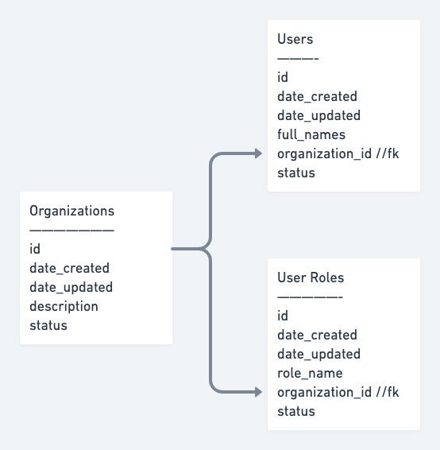

# nodejs-graphql-base
A GraphQL implementation of a NodeJS API GW leveraging Sequelize ORM

## Application Base Structure
 **src**  
|__ **bin** - _[start script]_  
|__ **database** _[Sequelize specific implementations & database models]_ 
|___ config 
|___ migrations 
|___ models 
|___ seeders 
|__ **graphql** - _[GraphQL specific implementations]_ 
|___ resolvers 
|___ typedefs 
|___ index.js 
|___ schema.js 
|__ **app.js** - _[Application Boostrap]_  
**.gitignore** 
**nodemon.json** 
**package.json** 

## Sample database schema

### Database creation
>  npx sequelize-cli db:create
### Sequelize model generation
#### By using **sequelize-cli**

> Model files & migration files can be generated using **sequelize-cli** .
> 
> For purpose of this project, find below sample commands to effect the above schema in sequelize models.

#### Organizations

> npx sequelize-cli model:generate --name Organizations --attributes description:STRING,status:INTEGER --file-name Organization --underscored

#### Users

> npx sequelize-cli model:generate --name Users --attributes full_names:STRING,organization_id:INTEGER,user_role_id:INTEGER,status:INTEGER --file-name User --underscored

#### UserRoles

> npx sequelize-cli model:generate --name UserRoles --attributes role_name:STRING,organization_id:INTEGER,status:INTEGER --file-name UserRole --underscored 

#### By using **sequelize-auto**

> In-case database is already created, model files can be generated using **sequelize-uato**
> > sequelize-auto -o "./src/models/Database/models" -d database_development -h localhost -u root -p 3306 -e mysql -l es6 --cm p --cf p --cp l

### Sequelize migrations

Once the model files & migration files have been generated from the above steps, the below command can be executed to ensure that tables are setup appropriately in database.

> npx sequelize-cli db:migrate